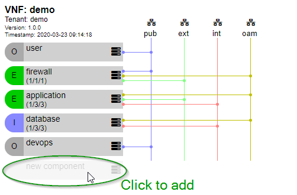

# vnf-designer

[Live Demo](https://bernardtsai.github.io/vnf-designer/)

[](https://bernardtsai.github.io/vnf-designer/)

A simple webpage capable of:
- modelling the networks, components (incl. images and flavors) and ports of VNFs,
- validating the model design,
- comparing differences between two models (current state and target state),
- importing and exporting models,
- generating automation artefacts for deploying VNFs onto OpenStack clouds and
- generating the communication matrix for a VNF.

It makes use of an internal canonical model.
This model can be rendered with the help of jinja alike templates into any kind of desired output.
The rendering capabilities can be extended by simply adding new templates into templates.js.

A model of a demo solution is provided as an example.

For further questions please contact: bernard@tsai.eu

# Quick start

Prerequisites
-------------
- node.js and npm have been installed
- nodeenv has been installed (optional - if a virtual node environment is needed)
- access to OpenStack APIs (directly or via http/s_proxy settings)

## Project setup
```
npm install
```

### Compiles and hot-reloads for development
```
npm run serve
```

### Compiles and minifies for production
```
npm run build
```

### Run your tests
```
npm run test
```

### Lints and fixes files
```
npm run lint
```

### Customize configuration
See [Configuration Reference](https://cli.vuejs.org/config/).
