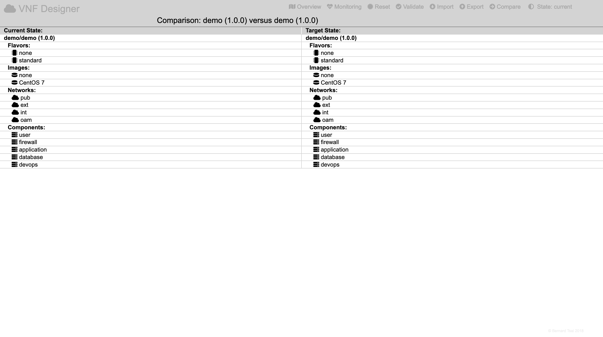

Comparison
==========

The VNF Designer can manage two versions of a virtualised network function in parallel describing both the current and target state of the VNF.

It is possible to toggle between these states by clicking on the "State" icon in the header region.

The difference between these states can be shown by clicking on the "Compare" icon in the header region.

It will display the current state and target state side by side listing all elements in which:

* new elements will be shown in green,
* deleted elements will be shown in red,
* modified elements will be shown in blue and
* unmodified elements will be shown in black.

-----

<a style="text-decoration: none;" href="doc.html?usage.md">usage</a>

