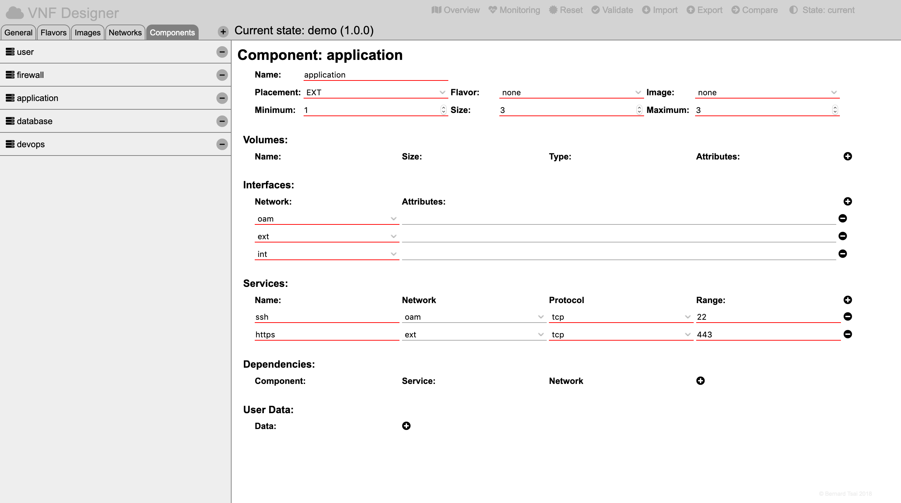

Components
==========

Components may be internal components of a VNF, external communication parters or routers bridging different networks.

Editing a Component
-------------------

Select the overview by pressing the "Overview" icon in the header region.


Then click on the component icon of the component which needs to be modified.



The web-form for the component will be presented in the details region and will allow to:

* modify the name,
* specify the placement/type of the component (management/external/internal/other/router),
* specify the flavor of the component (if management,external or internal),
* specify the image of the component (if management,external or internal),
* specify the minimum size of instances for the component (if management,external or internal),
* specify the default size of instances for the component (if management,external or internal),
* specify the maximum size of instances for the component (if management,external or internal),
* specify volumes for the component:
  * name,
  * size in gigabytes,
  * storage type (either external or internal) and
  * additional attributes as a string,
* specify the ports for the component:
  * network,
  * special interface attributes (e.g. fixed IP addresses or allowed address pairs),
* specify the exposed service interfaces:
  * name of the service,
  * network interface via which the service is exposed,
  * protocol (tcp, udp, icmp, sctp, any, none) and
  * port-range (e.g. 22 for ssh or 8080-8081 for a port range),
* specify dependencies to other services:
  * name of the component,
  * name of the service which the component exposes,
  * network via which the service is consumed and
* specify user data as a list of strings.   

Specifying fixed IP addresses and/or allowed address pairs for a network interface requires adding

```
fixed: [IP-Address or IP-Address-Range];
```

and/or

```
allowed: [IP-Address or IP-Address-Range];
```

to the attribute of the interface.

Deleting an Existing Component
------------------------------

Select the overview by pressing the "Overview" icon in the header region.

Then press on the "Components" tab of the selector region.

Remove the component by pressing the "-" sign located to the right of the name of the specific component.

(Be aware that this might lead to inconsistencies in the model if any other components have previously referred to this component.)

-----

<div style="z-index:100; position: fixed; top: 16px; right: 16px;"><a style="text-decoration: none;" href="doc.html?usage.md">usage</a></div>
