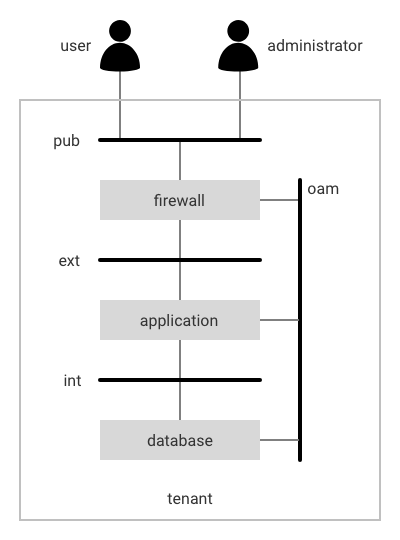

Example
=======

<a style="text-decoration: none;" href="doc.html">overview</a>

An example will help to demonstrate the capabilities of the VNF Designer.

In this example a simple application server hosted together with a database backend in a tenant is providing it's service via a firewall to users as shown in the diagram below.

The solution makes use of four networks for establishing communication amongst the applications, the users and administrators according to following considerations:

* users can access the application services from the internet (pub) via the firewall,
* administrators can manage the firewall, the application server and the database from the internet (pub) via the firewall,
* the firewall forwards external user requests via the machine-to-machine network (ext),
* the firewall forwards external administrative requests via the operation, administration and maintenance network (oam) and
* the application server persists its information to the database via the machine-to-machine network (int).

-----

<a style="text-decoration: none;" href="doc.html">overview</a>

