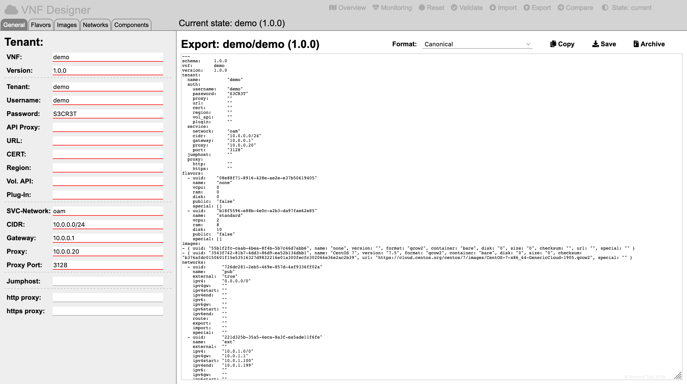

Export
======

To export the model click on the "Export" icon in the header region:

Select the "Canonical" format in the export page:

The model will copied to the clipboard when clicking on the "Copy" icon and can be downloaded when clicking on the "Save" icon.

-----

<a style="text-decoration: none;" href="index.html?usage.md">usage</a>

