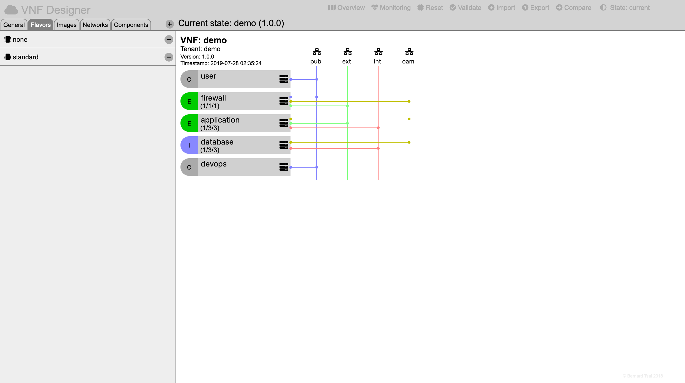
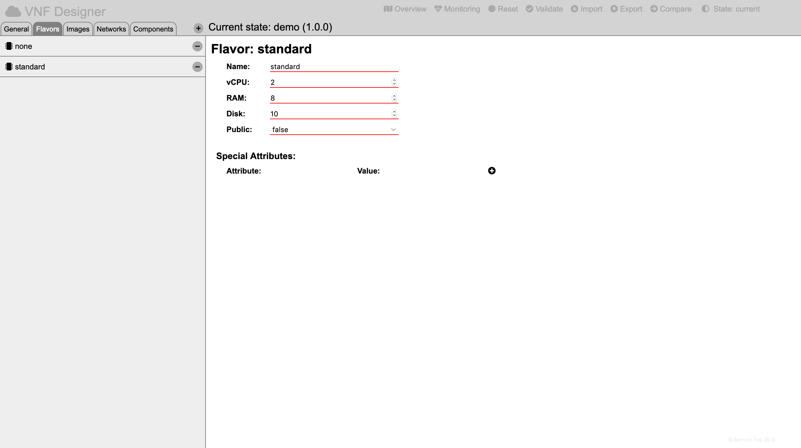

Flavors
=======

Flavors define the dimensions of a virtual server.

Creating a New Flavor
---------------------

Select the overview by pressing the "Overview" icon in the header region.

Then press on the "Flavors" tab of the selector region.

A "+" sign will appear on the top of the selector region which when pressed will create a new flavor.

Editing a Flavor
----------------

Select the overview by pressing the "Overview" icon in the header region.

Then press on the "Flavors" tab of the selector region.

Select the flavor by clicking on its name in the list display in the selector region.

The web-form for the flavor will be presented in the details region and will allow to:

* modify the name,
* specify the number of desired virtual central processing units,
* specify the size of the random access memory in gigabytes,
* specify the size of the ephemeral disk in gigabytes,
* specify wether the flavor should be public or private and to
* specify additional attributes as a set of key/value pairs.

Deleting an Existing Flavor
---------------------------

Select the overview by pressing the "Overview" icon in the header region.

Then press on the "Flavors" tab of the selector region.

Remove the flavor by pressing the "-" sign located to the right of the name of the specific flavor.

(Be aware that this might lead to inconsistencies in the model if any components have previously referred to this flavor.)

-----

<a style="text-decoration: none;" href="index.html?usage.md">usage</a>

