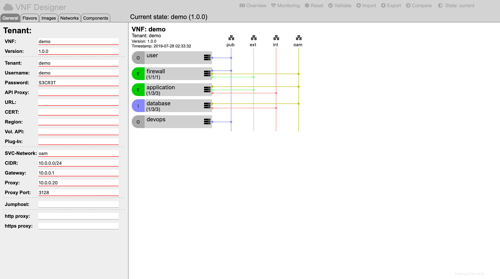
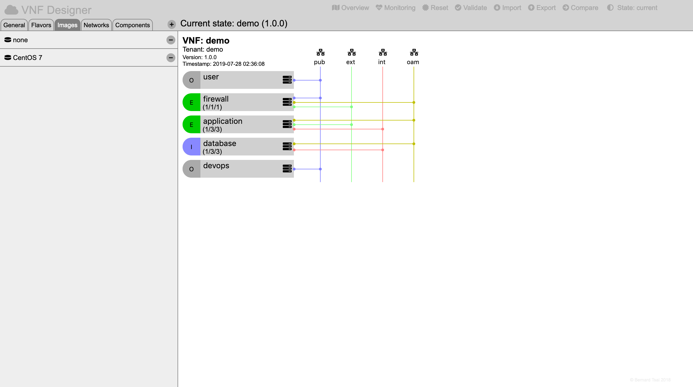
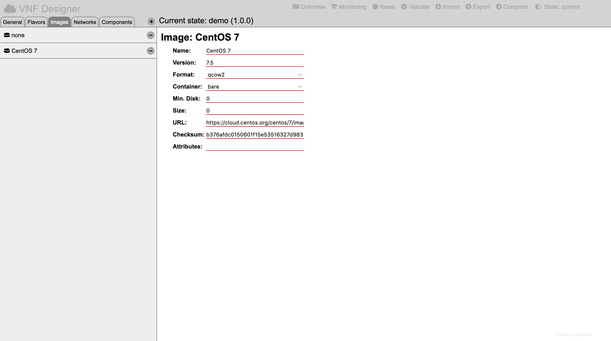

Images
=======

Images define the basic operating system for a virtual server (possibly including a set of software packages and configurations).

Creating a New Image
---------------------

Select the overview by pressing the "Overview" icon in the header region.

Then press on the "Images" tab of the selector region.

A "+" sign will appear on the top of the selector region which when pressed will create a new image.

Editing a Image
----------------

Select the overview by pressing the "Overview" icon in the header region.

Then press on the "Image" tab of the selector region.

Select the image by clicking on its name in the list display in the selector region.

The web-form for the image will be presented in the details region and will allow to:

* modify the name,
* specify the version,
* specify the format of image (e.g. raw, qcow2, ...),
* specify the format of the image (e.g. bare, ...),
* specify the min. size of the ephemeral disk in gigabytes,
* specify the size of the image in bytes,
* specify the url from which to retrieve the image,
* specify the checksum for the image and to
* specify additional attributes for the image as a string.

Deleting an Existing Image
--------------------------

Select the overview by pressing the "Overview" icon in the header region.

Then press on the "Images" tab of the selector region.

Remove the image by pressing the "-" sign located to the right of the name of the specific image.

(Be aware that this might lead to inconsistencies in the model if any components have previously referred to this image.)

-----

<a style="text-decoration: none;" href="index.html?usage.md">usage</a>

