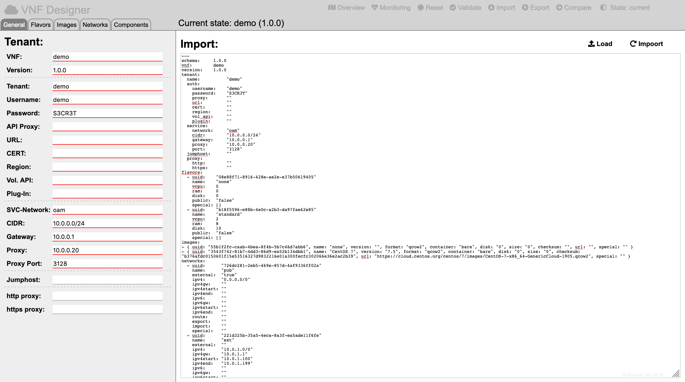

Import/Export
=============

To import a model click on the "Import" icon in the header region:

Then either upload a model by clicking on the "Load" icon or paste the contents of a model into the textarea:

To finally import the model click on the "Import" icon.

The VNF Designer will display an error message in the case of any validation errors.

-----

<a style="text-decoration: none;" href="index.html?usage.md">usage</a>

