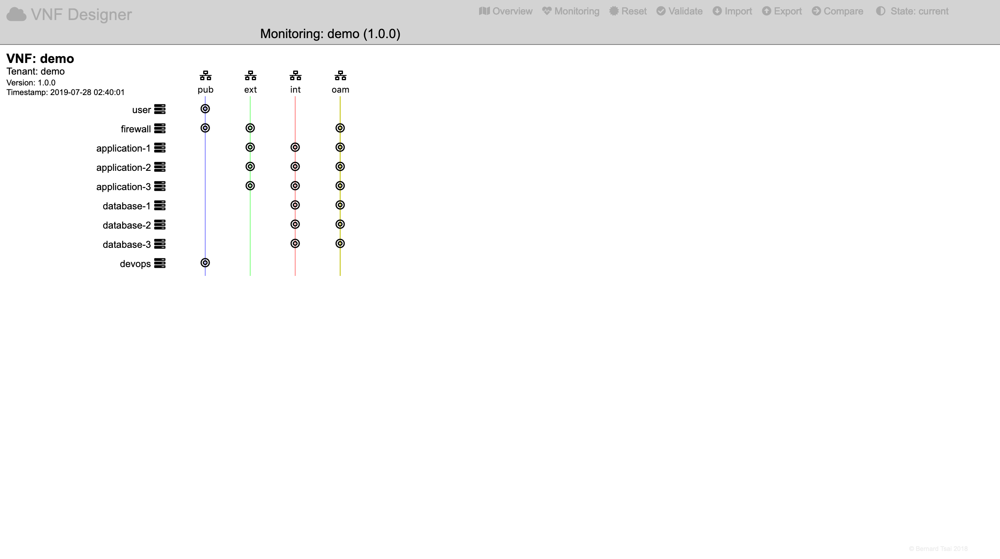

Monitoring
==========

This option is only available when utilising the VNF Designer as a web-service.

It allows to determine the status of a current deployment by clicking on the "Monitoring" icon in the header region:

It will display the architecture of the virtualised network function and update the status every 10 seconds:

* the status for entities in black is unknown,
* entities in red are down or are in a failure state,
* entities in green are active and show no errors.

-----

<a style="text-decoration: none;" href="index.html?usage.md">usage</a>

