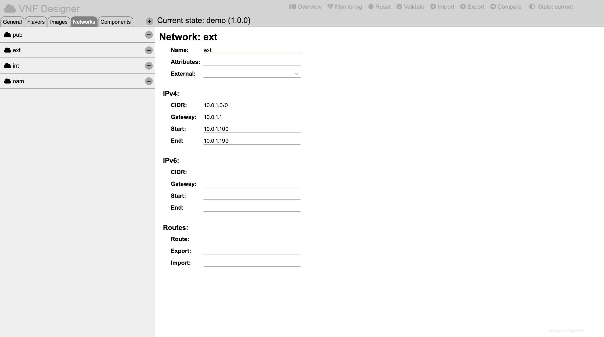

Networks
========

Networks define the L2/L3 communication domains via which components may interact.

Editing a Network
----------------

Select the overview by pressing the "Overview" icon in the header region.

Then click on the network icon of the network which needs to be modified.

The web-form for the network will be presented in the details region and will allow to:

* modify the name,
* specify additional attributes for the network as a string,
* specify if the network has been created externally,
* specify the IPv4:
  * CIDR,
  * IP Gateway,
  * DHCP pool start address,
  * DHCP pool end address,
* specify the IPv6:
  * CIDR,
  * IP Gateway,
  * DHCP pool start address,
  * DHCP pool end address,
* specify the external route information:
  * route target,
  * exports and
  * imports.

Deleting an Existing Network
-----------------------------

Select the overview by pressing the "Overview" icon in the header region.

Then press on the "Networks" tab of the selector region.

Remove the network by pressing the "-" sign located to the right of the name of the specific network.

(Be aware that this might lead to inconsistencies in the model if any components have previously referred to this network.)

-----

<a style="text-decoration: none;" href="doc.html?usage.md">usage</a>

