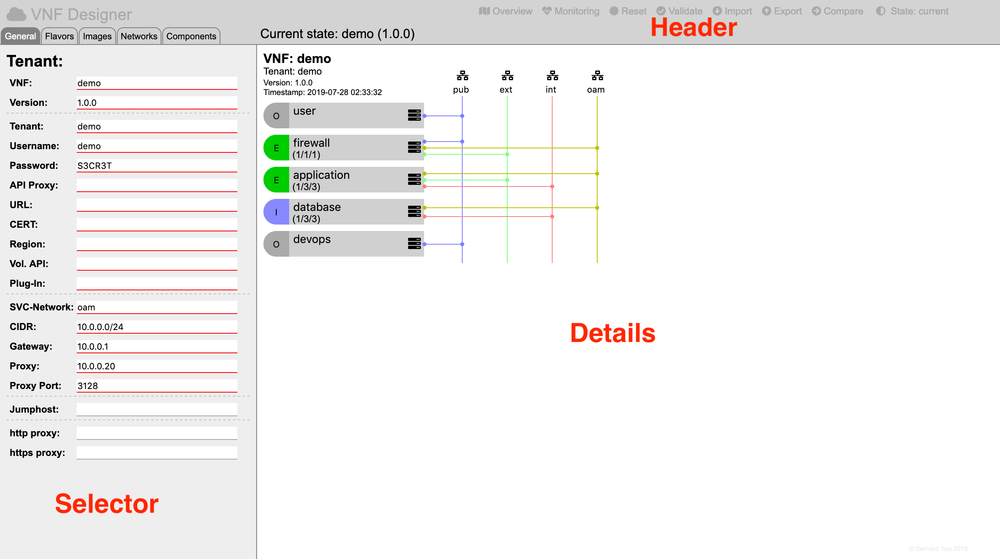

User Interface
--------------

The UI of the VNF Designer is structured into three regions

**Header**:    

the header region is located at the top of the page and displays a set of icons which allow to trigger special functions (e.g. importing/export and validating the model etc.).

**Selector**:    

the selector region is located at the left of the page and provides an overview of all the elements needed to describe a VNF. It has tabs at the top to distinguish between resources (flavors, images, networks and components) and general information. Underneath it either shows tenant related parameters or a list of resources of a specific type.

**Details**:

this region is located on the right side of the page and shows either:

* the architectural overview of the VNF,
* web-forms to describe resource specific parameters or
* transaction related information (e.g. for importing/exporting a model).

-----

<a style="text-decoration: none;" href="index.html">overview</a>

