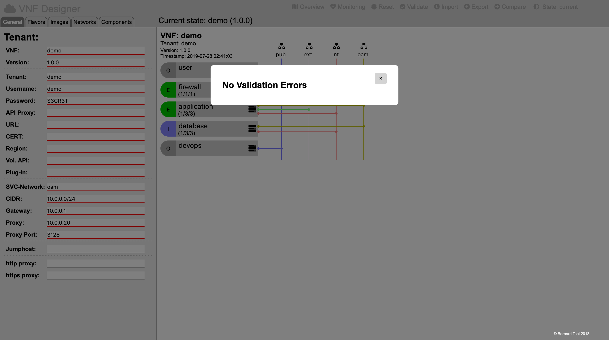

Validation
==========

Validating the model is achieved by simply clicking on the "Validate" icon in the header region.

The VNF designer will try to focus on the location of any perceived  inconsistency.

-----

<a style="text-decoration: none;" href="index.html?usage.md">usage</a>

